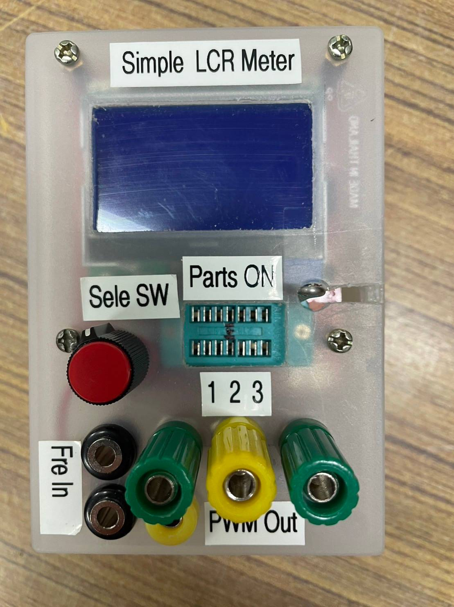
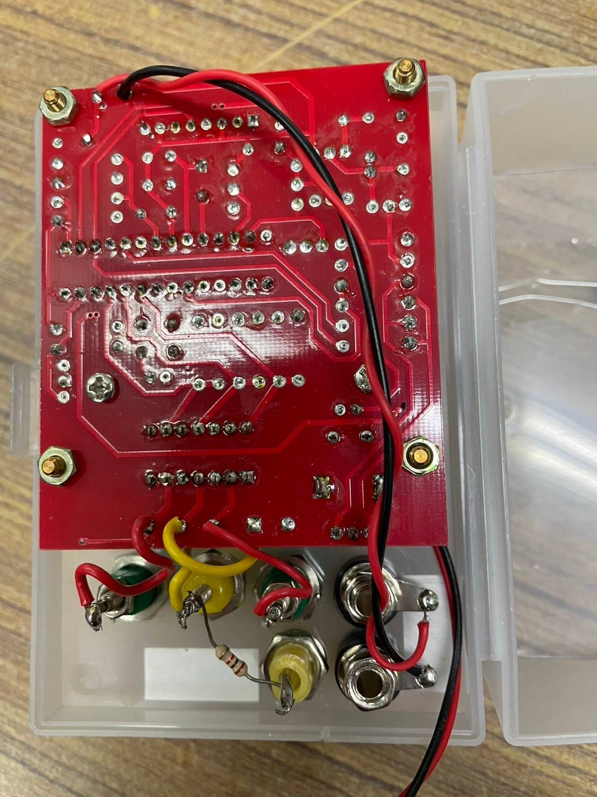
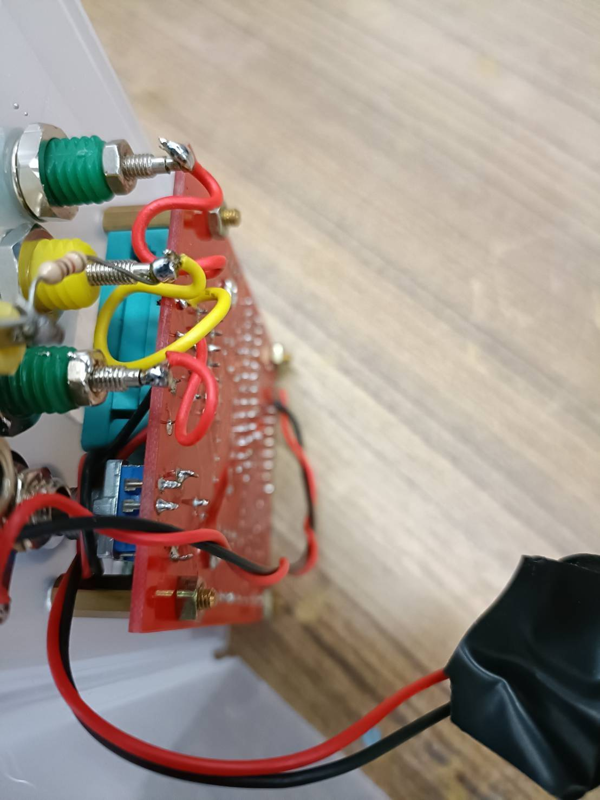
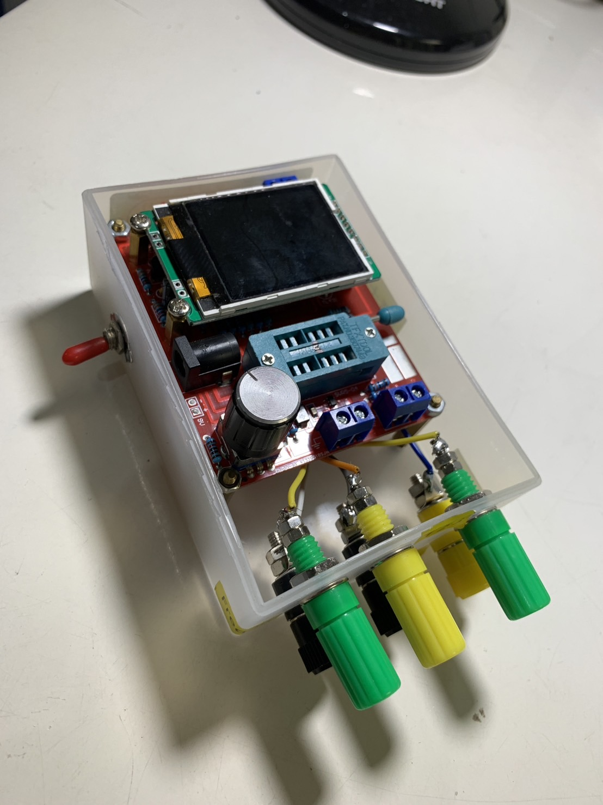
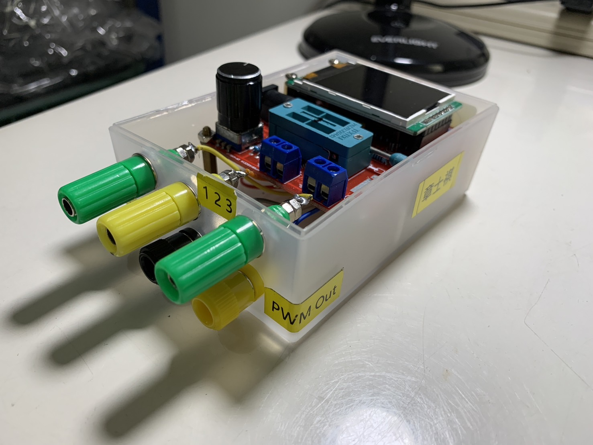

# RLC meter

- 規格型號：Transistor tester GM328A
- [使用手冊](./esr_tester_GM328_manual.pdf)
- [電路圖](./Transistor%20tester%20GM328A/Schematic_Transistor%20tester%20GM328A_2020-04-30_00-19-43.pdf)
- 老師的成品圖

  

  

  

- 我的成品圖

  我在左手邊加了一個開關，這樣方便不用把電池拔掉，就能斷電了。

  

  
  
- [Firmware](./Transistor%20tester%20GM328A/Firmware/)

- 問題：
  
  春生的板子無法開機。

- 分析對策：

  2023/12/19

  昨天春生的PCB經檢查後，發現7550這顆穩壓IC有問題 (無輸出電壓)，會再去買比較容易買到的 7805L 替代，看有沒有機會修復。

  2023/12/26

  今天將 7550 以 7805 取代後，已可以開機，但是發現 7805 有些微發熱，經量耗電流約 50 mA，量正常板子約20 mA，應該是還有其它問題，造成 7550 燒壞，不過先到這邊就好了。
