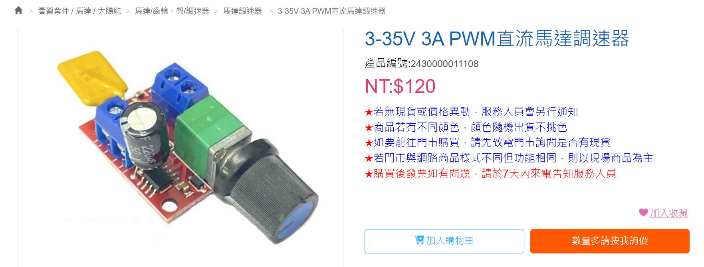

# 車用暖風機

- 目的：
  >老師 請問這是直流24v 可以修改成調整轉速嗎
  >調整直流電壓就可以調整轉速？還是要用pwm方式？

- 回覆：
  >用PWM控制風扇電壓
  >`U26 PWM直流電機調速器6V12V24V28V 3A調速開關` https://www.ruten.com.tw/item/show?21735029160714

- 購買模組：
  
  於今華電子購買`3-35V 3A PWM直流馬達調速器`
  

- 修改結果Demo：
  - [車用暖風機修改_使用PWM模組調整轉速_1](https://youtube.com/shorts/rmQ8HAMF91Q)
  - [車用暖風機修改_使用PWM模組調整轉速_2](https://youtube.com/shorts/hH4KJoRutuY)
