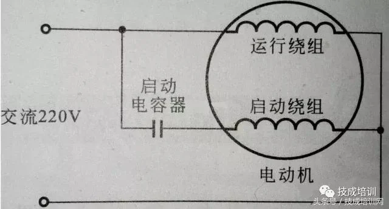

# 啟動電容原理

因為單相電源有區別於三相電源，在電動機中會發生三相旋轉磁場，單相電動機電容啟動原理是：利用電容器在電路中電流超過90度，使其啟動繞組中產生一個超前主繞組90度的磁場，這樣在電動機中會有一個互為90度夾角的交替磁場，通俗說，就是利用電容器的移相原理把單相電源變成互為90度的兩相電源，在電動機中產生一個互為90度的旋轉磁場，有旋轉磁場，電動機才可以轉動。

原文網址：https://kknews.cc/home/lrlv25e.html
