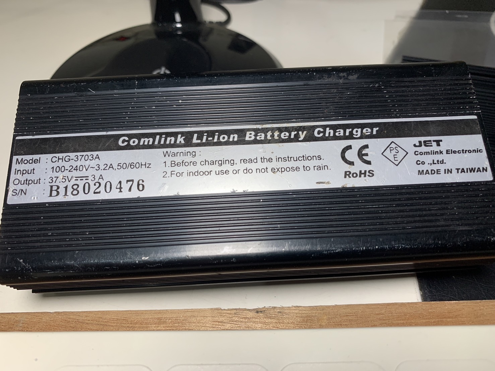
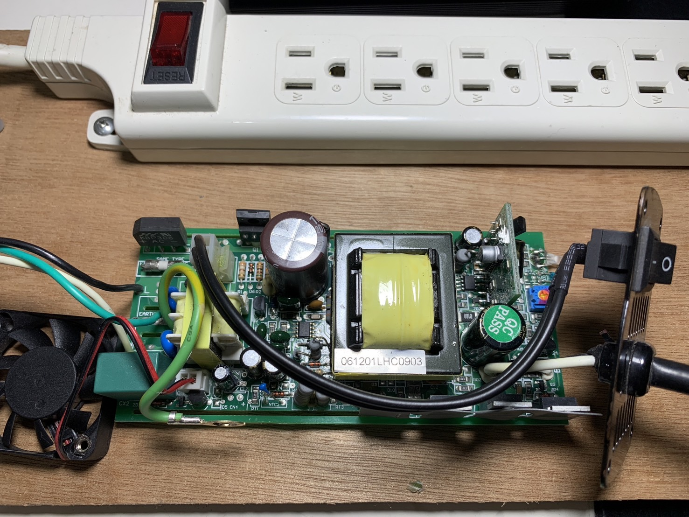
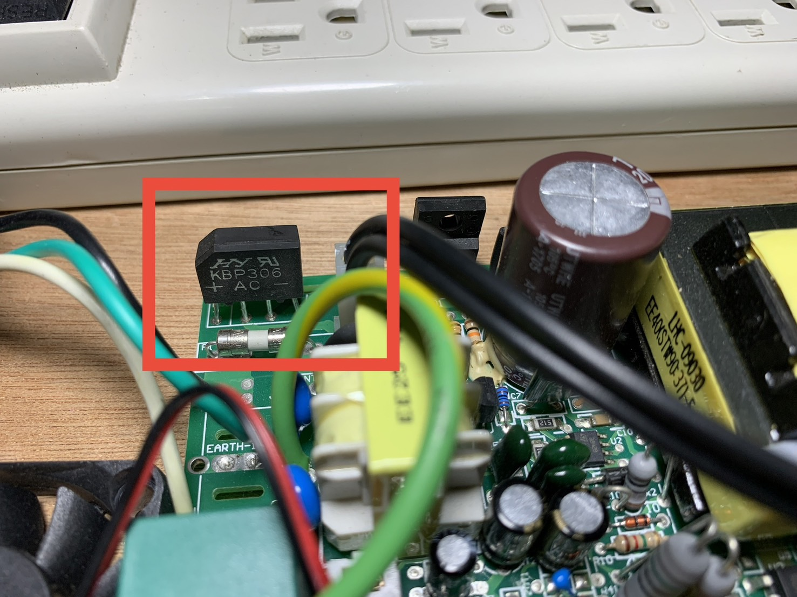

# 割草機充電器

- 規格：

    ```
    東林割草機充電器
    型號：CHG-37V03H
    機身尺寸：10*8*5cm
    電池重量：淨重：約0.7kg (加外盒包裝約0.9kg)
    電源：AC 100V - 240V
    輸出：37.5V - 3A
    ```

- 現象：

    > 老師，請問一下，這是割草機的充電器，110轉dc 37v，壞了，發現無電壓輸出，經檢查後，左邊黑白線為110輸入有電壓，保險絲也有通，中間黑色2條線為開關，量測也有通，不過左下風扇無電壓輸出，風扇不會動，看起來板子壞了，目前量到左上角的橋式整流器AC端有110v，輸出+-端應該是全波整流輸出，我用DC量是160V，這樣是正確的嗎？
    
    
    

- 回覆：

    >橋式整流的DC輸出+整流電容=110v x 1.414=155.6, 所以160Vdc 是正確的！

- 問：

    >110x1.414不是峰值電壓嗎？用電錶dc檔量時，量到的應該是平均電壓110/1.11 = 100嗎？還是因為後面+整流電容才這樣算的？

- 回覆：

    >+整流平滑電容後，電壓會在電容上充電至最高峰值，110v是rms有效值，rms x 根號2=最大值！
