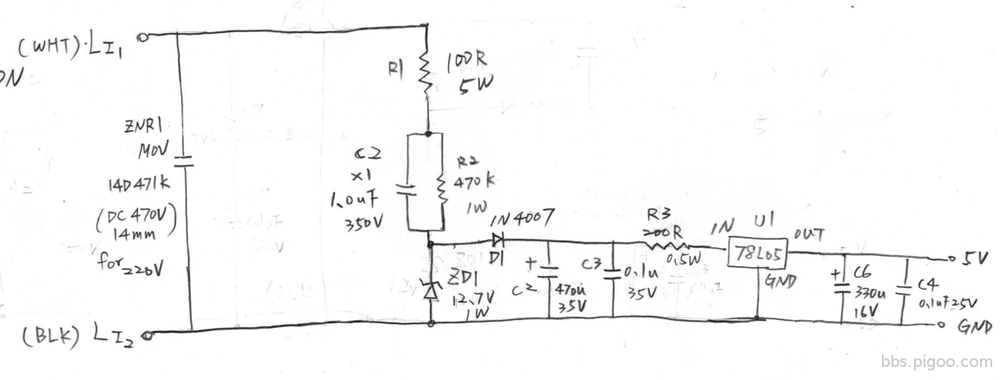
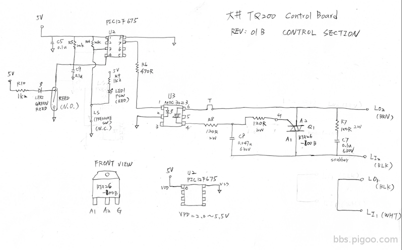
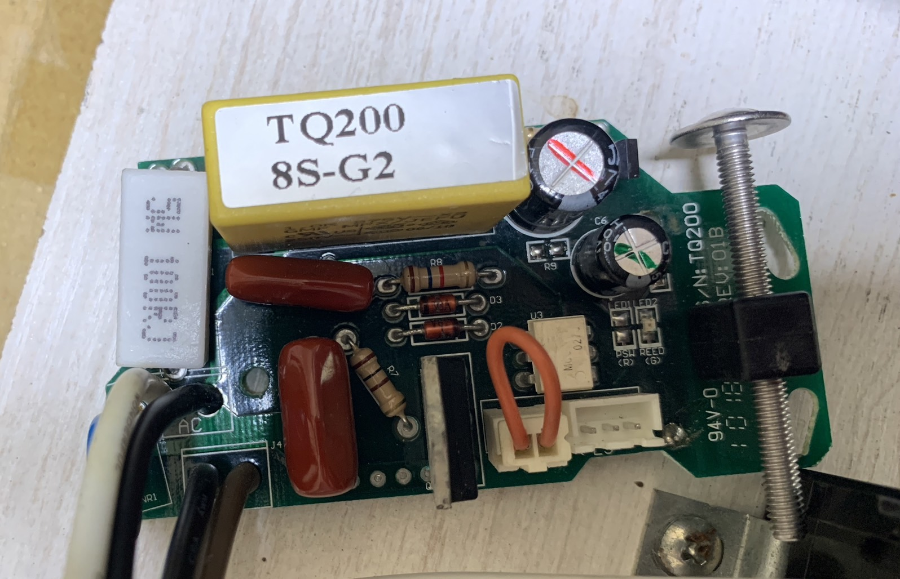
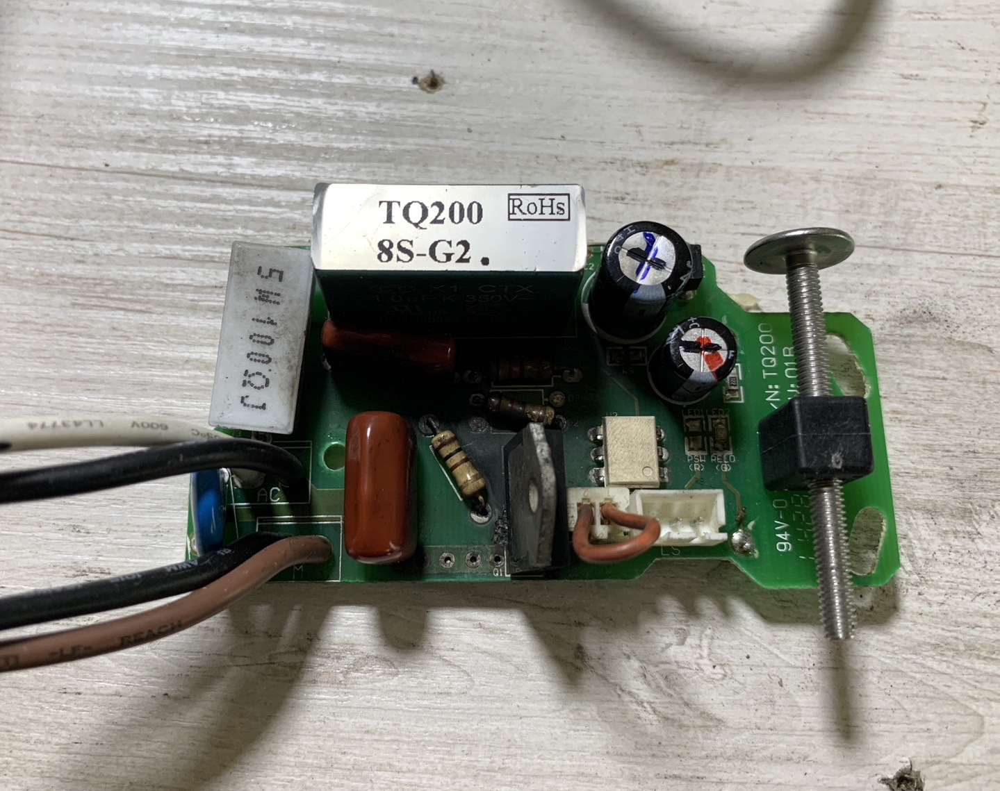
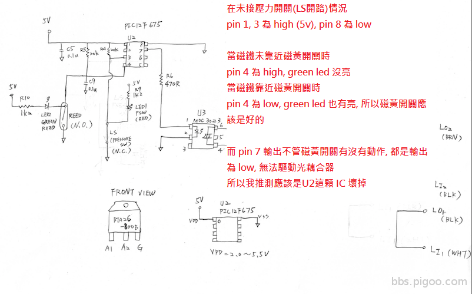
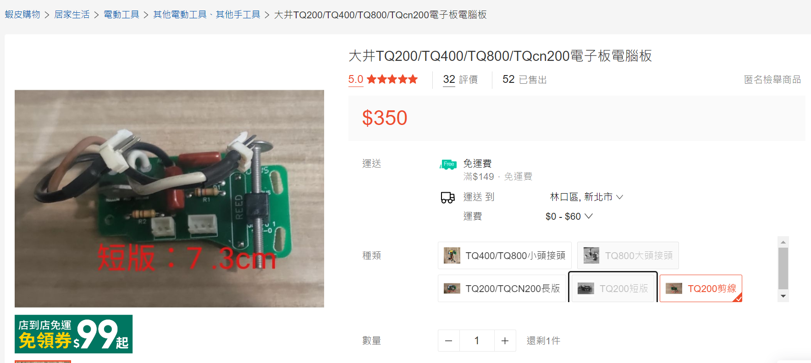

# 加壓馬達

- 規格：大井泵浦-TQ200
- [user manual](./大井-TQ系列.pdf)
- 線路圖
  
  

## case A

- 問題現象：

  接上電源後，馬達持續運轉，不管有無進水(控制流量及壓力開關)，馬達都不會停止。

  
  

- 分析結果：
  - TRIAC 壞了
  - PIC12F675 壞了

- 分析過程：
  - 目測 TRIAC 這顆燒黑，所以先更換這顆元件，更 換完後，流量開關可控制馬達 ON/FF，但是壓力開關無法控制，不管壓力開關有無按下，都會持續運轉。
  - 量測壓力開關兩端電壓，未按下時(代表管內無水，Normal Close)，電壓應該為 low，實際量測也是low，當按下開關時(代表管內有水)，電壓應該為high，實際量測也是 high，所以壓力開關沒有問題，代表 PIC 這顆IC壞了。
  

- 解法：
  - 更換TRIAC
  - 以電晶體 A1015 (PNP) 及二極體 1N4148 取代 PIC 這顆IC，如附件線路圖，藍色部份。

- 動作原理分析：

  - 壓力開關 close 時(管內無水)，不管電晶體有沒有導通(即流量開關有無動作)，U3 pin 1 都為low，馬達不動作。

  - 壓力開關 open 時(管內有水) 流量開關 open 時(無進水)，電晶體Vb等於5V，所以電晶體不導通，u3 pin 1為 low，馬達不動作。流量開關 close 時(有進水)，Vbe順偏，電晶體導通，u3 pin 1為high，馬達動作。
  
  - 二極體作用，只為了讓電晶體Ic 電流流過，防止左邊電流進 u3。

  - 電晶體 B 極上的電阻為限流電阻，防止電晶體燒掉。

## case B

- 問題現象：

  接上電源後，馬達不會運轉，不管有無進水(控制流量及壓力開關)，馬達都不會啟動。

## 結論

雖然 case a 的問題解決，但因板子有rework過，而且這是大電壓且長期放在屋頂上無法觀察到，有安全性的問題，會有點怕怕的，剛好在網路上找了有賣這電路板，直接買了2塊直接替換掉，也算是解決了。
